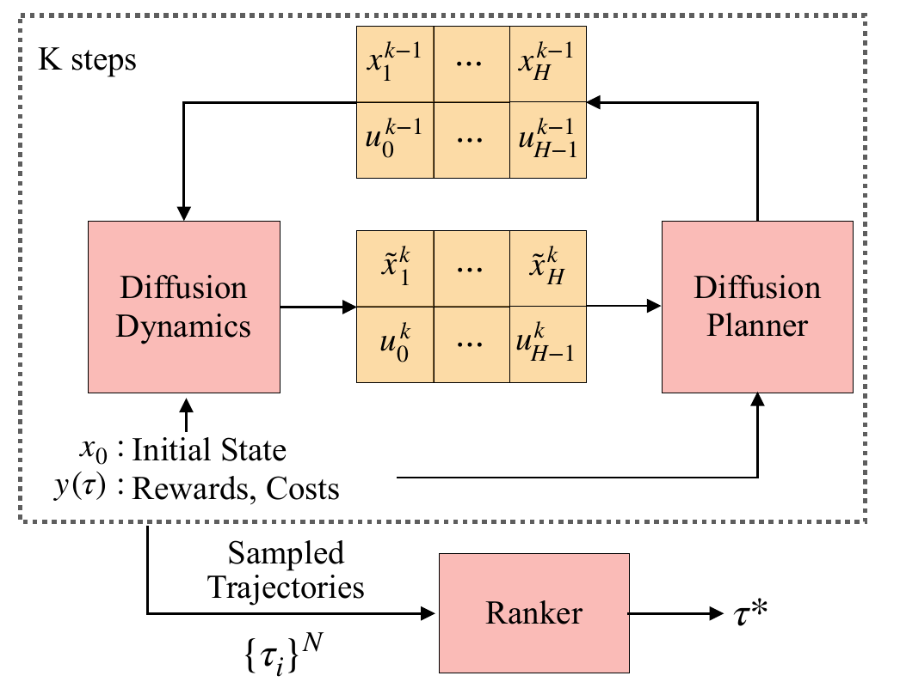

# MPDiffuser

### [Paper](https://arxiv.org/abs/2512.08280) | [Project Page](TODO)


<p align="center">
  <a href="assets/FrameworkFig.pdf"></a>
</p>

This repo contains the official implementation of Model-Based Diffusion Sampling for Predictive Control in Offline Decision Making.
> [**Model-Based Diffusion Sampling for Predictive Control in Offline Decision Making**](https://arxiv.org/abs/2512.08280)<br>
> [Haldun Baim](https://haldunbalim.github.io/), [Na Li](https://nali.seas.harvard.edu), [Yilun Du](https://yilundu.github.io/)
> <br>Harvard<br>

## Setup

Create an environment and install the package in editable mode.

```bash
conda create -n mpdiffuser python=3.10 -y
conda activate mpdiffuser
```

Install JAX for your accelerator first, then install the remaining dependencies.

```bash
pip install -U "jax[cuda12]"

pip install -r requirements.txt
pip install -e .
```


## Data

Dataset configs live in `configs/dataset`, choose from D4RL, DSRL, or custom HDF5 datasets. Each HDF5 file is expected to contain episode groups such as `sample_0`, `sample_1`, etc., with fields including:

```text
observations
actions
rewards
terminations
```

Optional fields such as `costs` are used by constrained/safety experiments.


## Training

Training is launched through Hydra. To train the MPDiffuser components for a dataset, train both the planner and dynamics model with matching dataset and horizon settings:

```bash
python scripts/train.py model=planner dataset=d4rl dataset.dset_name=hopper-medium-v2

python scripts/train.py model=dynamics dataset=d4rl dataset.dset_name=hopper-medium-v2
```

Reward and cost models can be trained for candidate ranking and constrained evaluation:

```bash
python scripts/train.py model=reward dataset=d4rl dataset.dset_name=hopper-medium-v2
python scripts/train.py model=cost dataset=dsrl dataset.dset_name=OfflineHopperVelocityGymnasium-v1
```

## Evaluation

The evaluation scripts load saved checkpoints, roll out the corresponding policy in the environment, and print nominal and normalized returns. When saving is enabled, summary files are written under `outputs/<dataset>/`.

**MPDiffuser**

Evaluate MPDiffuser with a trained planner and dynamics model:

```bash
python scripts/test.py \
  --dset-name hopper-medium-v2 \
  --horizon 32 \
  --n-trials 50 \
  --cfg-scale 2.0 \
  --return-scale 1.1 \
  --temperature 0.001
```

Use `--n-samples > 1` to sample multiple candidates and rank them with trained reward/cost models. For constrained tasks, pass `--cost-limit` and tune `--cost-scale`.
