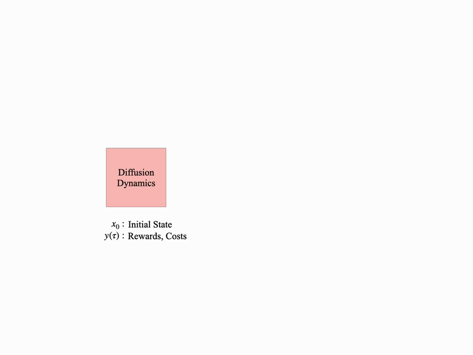

# MPDiffuser

### [Paper](https://arxiv.org/abs/2512.08280) | [Project Page](TODO)

<p align="center">
  
</p>

Official implementation of **Model-Based Diffusion Sampling for Predictive Control in Offline Decision Making**.

> [**Model-Based Diffusion Sampling for Predictive Control in Offline Decision Making**](https://arxiv.org/abs/2512.08280)  
> [Haldun Balim](https://haldunbalim.github.io/), [Na Li](https://nali.seas.harvard.edu), [Yilun Du](https://yilundu.github.io/)  
> Harvard

---

## Setup

```bash
conda create -n mpdiffuser python=3.10 -y
conda activate mpdiffuser
```

Install JAX for your accelerator, then the remaining dependencies:

```bash
pip install -U "jax[cuda12]"   # or jax[cpu] / jax[rocm] etc.
pip install -r requirements.txt
pip install -e .
```

---

## Datasets

Dataset configs live in `configs/dataset/`. Three backends are supported:

| Config | Class | Use case |
|---|---|---|
| `d4rl.yaml` | `D4RLDataset` | D4RL / MuJoCo locomotion |
| `dsrl.yaml` | `DSRLDataset` | Safety-Gymnasium offline datasets |
| `hdf.yaml` | `HDFDataset` | Custom HDF5 files |

**HDF5 format** — each file should contain episode groups `sample_0`, `sample_1`, … with fields `observations`, `actions`, `rewards`, `terminations` (and optionally `costs`).

---

## Training

All training is launched via Hydra from the project root.  
Checkpoints are saved under `outputs/<dataset>/<ModelClass>/<run-name>/`.

### MPDiffuser (planner + dynamics)

```bash
# FiLM-conditioned planner
python scripts/train.py model=planner dataset=dsrl \
    dataset.dset_name=OfflineHalfCheetahVelocity-v1

# Dynamics model
python scripts/train.py model=dynamics dataset=dsrl \
    dataset.dset_name=OfflineHalfCheetahVelocity-v1
```

### Decision Diffuser

```bash
python scripts/train.py model=dec-diffuser dataset=d4rl \
    dataset.dset_name=hopper-medium-v2

python scripts/train.py model=inv-dyn dataset=d4rl \
    dataset.dset_name=hopper-medium-v2
```

### Planner only (classifier-free guidance)

```bash
python scripts/train.py model=planner dataset=d4rl \
    dataset.dset_name=hopper-medium-v2
```

### Diffuser (value-guided)

```bash
python scripts/train.py model=diffuser dataset=d4rl \
    dataset.dset_name=hopper-medium-v2

python scripts/train.py model=value dataset=d4rl \
    dataset.dset_name=hopper-medium-v2
```

### Reward / cost models (multi-sample ranking)

```bash
python scripts/train.py model=reward dataset=d4rl \
    dataset.dset_name=hopper-medium-v2

python scripts/train.py model=cost dataset=dsrl \
    dataset.dset_name=OfflineHalfCheetahVelocity-v1
```

**Run-name conventions** (set automatically by each model class):

| Model | Folder | Run name |
|---|---|---|
| `Planner`, `Diffuser`, `DynamicsModel`, `DecisionDiffuser` | `<ClassName>/` | `cfg-h<H>-s<S>-eps` (predict_noise) or `cfg-h<H>-s<S>` |
| `ValueFunction` | `Valuefunction/` | `value-h<H>` |
| `RewardModel`, `CostModel`, `InvDynModel` | `<ClassName>/` | `model` |

---

## Evaluation

All methods share a single evaluation entry point.

```
python scripts/test.py --method <METHOD> [options]
```

| `--method` | Policy | Required models |
|---|---|---|
| `mpdiffuser` | MPDiffuser | Planner + DynamicsModel |
| `planner` | PlannerPolicy | Planner |
| `dd` | DDPolicy | DecisionDiffuser + InvDynModel |
| `guided` | DiffuserPolicy | Diffuser + ValueFunction |


### Examples

**MPDiffuser on a safety dataset:**
```bash
python scripts/test.py --method mpdiffuser \
  --dset-name OfflineHalfCheetahVelocity-v1 \
  --horizon 32 --predict-noise \
  --cost-limit 20 --return-scale 1.05 \
  --cfg-scale 5.0 -tmp 0.001
```

**Planner on D4RL:**
```bash
python scripts/test.py --method planner \
  --dset-name hopper-medium-v2 \
  --predict-noise --cfg-scale 2.0 --return-scale 1.1
```

**Decision Diffuser:**
```bash
python scripts/test.py --method dd \
  --dset-name hopper-medium-v2 \
  --predict-noise --cfg-scale 2.0
```

---

## Pretrained Checkpoints

Pretrained model checkpoints will be released on [🤗 Hugging Face](https://huggingface.co/) — **coming soon**.

---

## Citation

```bibtex
@article{balim2024mpdiffuser,
  title   = {Model-Based Diffusion Sampling for Predictive Control in Offline Decision Making},
  author  = {Balim, Haldun and Li, Na and Du, Yilun},
  journal = {arXiv preprint arXiv:2512.08280},
  year    = {2024}
}
```
